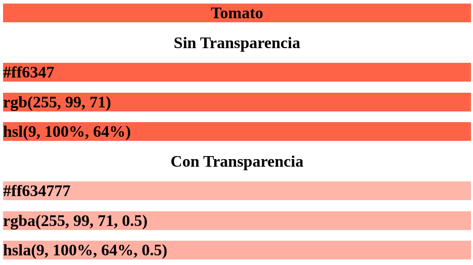

> DISEÑO DE INTERFACES WEB

# Tema 1: Planificación de interfaces gráficas
> REGLAS, COLOR, MODELO DE CAJA, TEXTO, LISTAS, TABLAS

## Introducción

## Formato de regla CSS


## Color

### Identificación

- Por **nombre**:  tomato
- Por **valor hexadecimal**: #ff6347
- Por **valores RGB**: rgb(255, 99, 71)
- Por **valores HSL**: hsl(9, 100%, 64%)


**Ejemplo**
```html
<!DOCTYPE html>
<html>
<body>

<h1 style="background-color: Tomato; text-align: center;">Tomato</h1>

<h1 style="text-align: center;">Sin Transparencia</h1>

<h1 style="background-color:#ff6347;">#ff6347</h1>
<h1 style="background-color:rgb(255, 99, 71);">rgb(255, 99, 71)</h1>
<h1 style="background-color:hsl(9, 100%, 64%);">hsl(9, 100%, 64%)</h1>

<h1 style="text-align: center;">Con Transparencia</h1>

<h1 style="background-color:#ff634777;">#ff634777</h1>
<h1 style="background-color:rgba(255, 99, 71, 0.5);">rgba(255, 99, 71, 0.5)</h1>
<h1 style="background-color:hsla(9, 100%, 64%, 0.5);">hsla(9, 100%, 64%, 0.5)</h1>

</body>
</html>
```




### Valores RGB

En CSS, un color se puede especificar como un valor RGB mediante esta fórmula:

**rgb ( rojo, verde , azul )**


- Cada parámetro (rojo, verde y azul) define la **intensidad del color entre 0 y 255**.
- Por ejemplo, rgb(255, 0, 0) se muestra en rojo, porque el rojo está configurado en su valor más alto (255) y los demás están configurados en 0.
- Para mostrar negro, establezca todos los parámetros de color en 0, así: rgb(0, 0, 0).
- Para mostrar blanco, establezca todos los parámetros de color en 255, así: rgb(255, 255, 255)
- Para mostrar alguna nivel de gris, establezca todos los parámetros de color con igual valor, así: rgb(200, 200, 200)


### Valores RGBA

Los valores de color RGBA son una extensión de los valores de color RGB con un **canal alfa**, que especifica la **opacidad de un color**.

Un valor de color RGBA se especifica con:

**rgba ( rojo, verde , azul, alfa )**

El parámetro alfa es un número **entre 0,0 (completamente transparente) y 1,0 (nada transparente)**


### Valores HSL

En CSS, un color se puede especificar usando tono, saturación y luminosidad (HSL) en la forma:

**hsl ( tono , saturación , luminosidad )**

- El tono es un grado en la **rueda de colores de 0 a 360 grados**. 0 es rojo, 120 es verde y 240 es azul.
- **La saturación es un valor porcentual**. 0% significa un tono de gris y 100% es el color completo.
- **La luminosidad es un valor porcentual**. 0% es negro, 50% no es ni claro ni oscuro, 100% es blanco


**Tono** o Hue


**Saturación** y **Luminosidad**


### Valores HSLA

Los valores de color HSLA son una extensión de los valores de color HSL con un **canal alfa**, que especifica la **opacidad de un color**.

Un valor de color HSLA se especifica con:

**hsla ( tono, saturación , luminosidad, alfa )**

El parámetro alfa es un número **entre 0,0 (completamente transparente) y 1,0 (nada transparente)**


## Modelo de caja (box model)


La propiedad **`box-sizing`** permite indicar si:

- Ancho y Alto se refiere al contenido. Valor **`content-box`**. Es el valor por defecto
- Ancho y Alto se refiere al margen exterior. Valor **`border-box`**

Muchos diseñadores prefieren usar un **border-box**, para así evitar descuadres:

```css
* {
  box-sizing: border-box;
}
```

## Texto

Las propiedades más frecuentes para el texto son las siguientes:

- `color`
- `font-family`
- `font-size`
- `font-weight`
- `text-align`
- `word-spacing`
- `letter-spacing`
- `line-height`

Para importar un tipo de letra o fuente, podemos usar la regla `@import`

Ejemplo:

```css
@import url('https://fonts.googleapis.com/css2?family=Fira+Code:wght@300;400;500&display=swap');

div {
    color: tomato;
    font-family: 'Fira Code', monospace;
    font-size: 1rem;  /* 16px */
    font-weight: 400;    
    word-spacing: 8px;
    letter-spacing: 1rem;
    line-height: 300px;
    text-align: center;
    text-decoration: none;
}
```

Los valores por defecto son:

```css
    font-size: 1rem;  /* o  font-size: 16px */
    font-weight: 400;
```

## Listas

La propiedad más usada es

- `list-style-type`


Ejemplos:

```css
ul {
  list-style-type: none;
  list-style-type: circle;
  list-style-type: square;
}

ol {
  list-style-type: none;
  list-style-type: upper-roman;
  list-style-type: lower-alpha;
}
```

## Tablas


## Recursos

### Herramientas

- [HTML Colors](https://htmlcolorcodes.com/)
- [Conversor de color](https://www.w3schools.com/colors/colors_converter.asp)
- [Fresh Background Gradients](https://webgradients.com/)
- [Gradient Generator](https://www.joshwcomeau.com/gradient-generator/)
- [Google Fonts](https://fonts.google.com)
- [Emojipedia](https://emojipedia.org/)
- [Algunos símbolos Unicode](https://www.w3schools.com/charsets/ref_utf_symbols.asp)

### Formación

- [Modelo de color HSL: qué es y qué ventajas tiene](https://www.uifrommars.com/que-es-hsl/)
- [Google Fonts Knowledge](https://fonts.google.com/knowledge)
